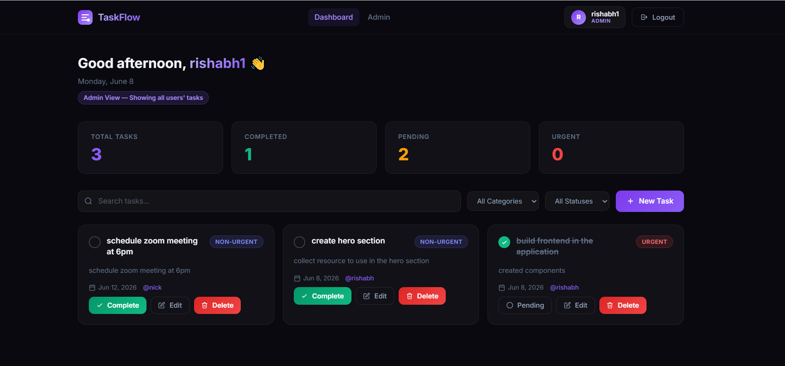

# TaskFlow — Secure Todo Application

A full-stack todo application with JWT authentication and role-based access control.



## Tech Stack

- **Frontend:** React 19, Vite, Tailwind CSS v4
- **Backend:** Node.js, Express.js, MongoDB (Mongoose)
- **Auth:** JWT + bcrypt


## Setup Instructions

### 1. Backend

```bash
cd backend
npm install
```

Create a `.env` file 

```
PORT=8000
MONGODB_URI=mongodb://localhost:27017/taskflow
JWT_SECRET=your_super_secret_key
JWT_EXPIRES_IN=7d
```

Start the backend:

```bash
npm start
```

### 2. Frontend

```bash
cd frontend
npm install
npm run dev
```

The frontend runs on `http://localhost:5173` and proxies all `/api` requests to `http://localhost:8000`.
